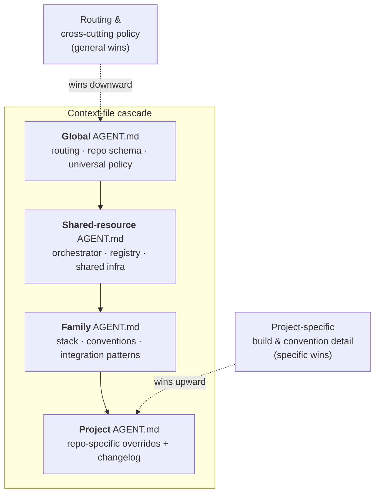

# The Context Cascade

> When a global rule, a team convention, and a project quirk all apply to the same task, the agent needs to know which one wins — *before* it has to guess. A declared precedence order across `AGENT.md` files makes the answer deterministic.

**Part of:** [AI Dev Governance](../README.md) · **Prerequisite reading:** [The Two Roles](two-roles.md)

> These per-directory instruction files are called `AGENT.md` here. In practice it's whatever your coding agent loads at startup — `CLAUDE.md`, `AGENTS.md`, `.cursorrules`, and so on. The cascade logic is identical regardless of the filename.

---

## The wall

One repo, one set of rules — easy. Twenty repos, and "the rules" are scattered: a global commit policy, a family-wide stack convention, one project that does a single thing differently. The agent reads them in no particular order and resolves conflicts by coin flip — applying a project-specific hack everywhere, or ignoring a project override because some family rule outranked it in the moment. Conflicting instructions with no declared precedence produce nondeterministic behavior, which is the exact opposite of governance.

## The rule

Declare a precedence order, and write it into the files themselves. Top to bottom:

1. **Global** — routing, the repo schema, universal policy.
2. **Shared resource** — governance for shared infrastructure, when the task touches it.
3. **Family** — stack, conventions, integration patterns for a group of repos.
4. **Project** — the most specific file; overrides the rest for that repo.

**More specific wins** for project detail; **more general wins** for routing and cross-cutting policy. Decide this once, up front — not in the middle of a conflict.

**Which way "wins" runs depends on the question:**

| The question is about… | Who wins | Why |
| :---- | :---- | :---- |
| Build/test/format/style detail for *this* repo | **Project** (most specific) | Only the project knows its quirks |
| Stack choice, integration pattern across the family | **Family** | The whole family shares it |
| Touching shared infrastructure (orchestrator, registry) | **Shared resource** | Cross-cutting governance must hold |
| Routing, security, commit discipline, universal policy | **Global** | These exist *to* override local convenience |

The two arrows in the diagram are the whole rule: **project-shaped questions resolve upward into specificity; policy-shaped questions resolve downward into generality.**

## How it works

Each level holds only what belongs at its scope. A rule that's true everywhere lives at Global; a rule true for one repo lives in that repo's `AGENT.md`. Conflicts resolve by the rule above: the project file wins on how *that* project is built; the global file still wins on policies that protect every project.

Each project's `AGENT.md` carries a **changelog** at the top — the load-bearing memory of what shipped and why. Family files change only when a pattern proven in one project is **promoted** to a family-wide standard, with a pointer to the reference implementation. Promotion is deliberate; copy-paste drift is not.

## Worked example

Task: format and commit a change in Project X.

- **Family standard:** "2-space indent."
- **Project X's `AGENT.md`:** "this repo uses tabs (legacy build tooling)."
- **Global:** "always type-check before commit."

Resolution: Project beats Family on indentation — specificity wins on project detail → **tabs.** Global still applies on top — cross-cutting policy wins → **run the type-check before committing.** No ambiguity, because the order was declared before the conflict arose.

## Anti-patterns

| Anti-pattern | Why it bites | Do instead |
| :---- | :---- | :---- |
| One giant rules file | Can't scope or override cleanly | Split by level; let specificity resolve |
| Duplicating a rule across levels | Copies drift; which is true? | State each rule once, at the right level |
| Editing the family file for a one-off | Pollutes every project in the family | Put the exception in the project file |
| No project changelog | The agent re-learns (and re-breaks) each session | Keep a changelog at the top of each `AGENT.md` |

## Adapt it to your setup

- **Solo / one repo:** you may need exactly one `AGENT.md`. Don't build a four-level cascade for a single project — add levels only when repos start sharing conventions.
- **When to add a level:** the moment two repos copy-paste the same rule, that rule wants to live one level up.
- **Different tools:** the file may be `CLAUDE.md`, `AGENTS.md`, or `.cursorrules` — the precedence logic doesn't change.

## Related

- [The Two Roles](two-roles.md) — the Executor reads this cascade at startup
- [Governance Sync](governance-sync.md) — keeping shared cascade files aligned across roles
- Back to the [main playbook](../README.md)
